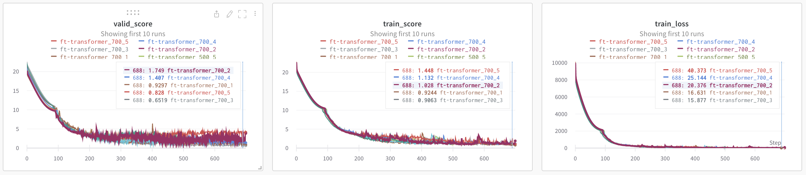
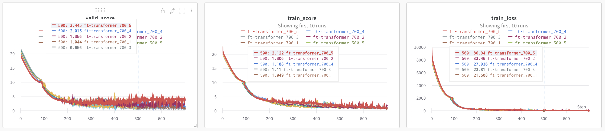

# Research on Energy efficiency Dataset

**This Project training Energy efficiecny dataset at once as a Tabular Deep Learning model[FT-Transformer] and stores Experimental results. additionaly use wandb.**

## Datasets
We use the dataset check [here](https://archive.ics.uci.edu/ml/datasets/energy+efficiency). We do not impose additional restrictions to the original dataset licenses, the sources of the data are listed in the paper appendix.
```bash
$cd data/ENB2012_data.xlsx
```

## Setup the Enviroment

```bash
$cd Researh
```

## Default
```bash
$python main.py --action train --data ENB2012_data.xlsx --task regression --target 1 --model fttransformer --fold 5 --savepath output  
```
## Results






</br>
</br>

## File Structure
```bash
├── Data
│   └── ENB2012_data.xlsx
│
├── Output
│   └── ft-transformer
│
├── yaml
│   └── fttransformer.yaml  "Model Architecture parameters.."   
│
├── main.py
├── dataset.py
├── train.py
├── model.py
│   └── ft-transformer.py
├── utils.py
etc..
``` 

## Papers and projects

| Name                                                          | Location                                                        | Comment        |
| :------------------------------------------------------------ | :-------------------------------------------------------------- | :------------- |
| quantitative estimation of energy performance of residential buildings  | [link](https://doi.org/10.1016/j.enbuild.2012.03.003) | OCIEM 2012     |
</br>

## How to cite
```
@article = {
    title = {Research on Energy efficiency Dataset},
    author = {Wongi Park},
    journal = {GitHub},
    url = {https://github.com/kalelpark/UCI_Energy_efficiency},
    year = {2022},
}
```
